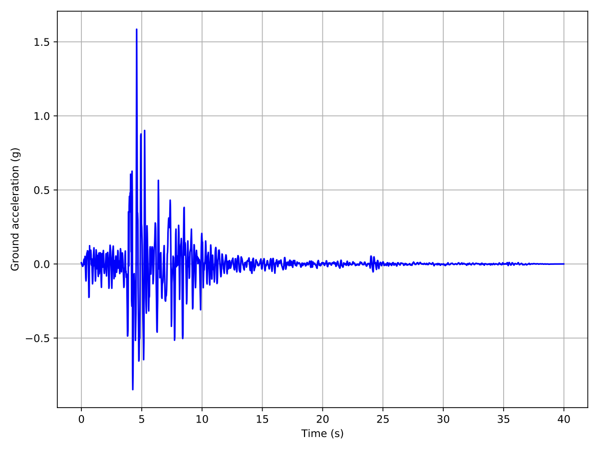
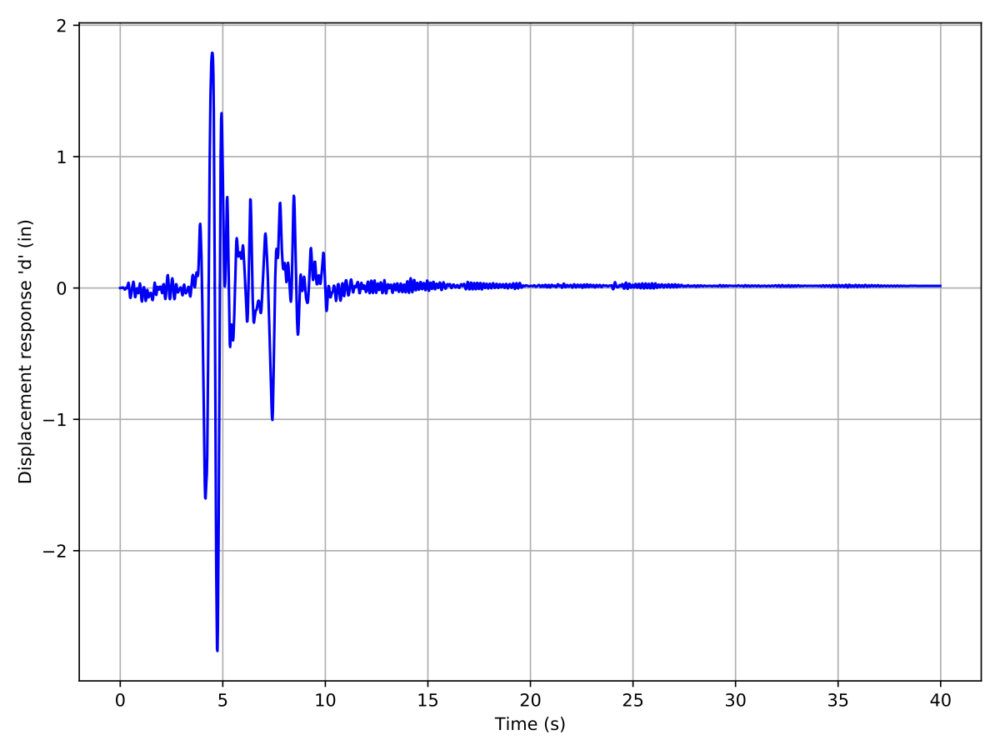

1-DoF Truss Element: Bayesian calibration of inelastic material model using PyMC3
=================================================================================

Outline
-------
In this example, Bayesian estimation is used to estimate the material 
parameters of a 1-degree of freedom truss structure given the data of its 
displacement time history after being subject to a known ground motion 
excitation.  The material parameters are modeled as random variables, and the 
Hamiltonian Monte Carlo (HMC) algorithm from the PyMC3 package is used to 
obtain samples from the posterior probability distribution of the material 
parameters.

Description of the model
------------------------
This is a pedagogical example of a finite element model of a 1-dof truss 
structure subjected to ground motion  excitation simulating an earthquake. The 
analysis is performed using OpenSees.

.. :width: 400

The element is made of structural steel with cross-sectional area 
of :math:`7.265 \ \mathrm{in}^2`.  

The material model used to represent the stress-strain behavior of the steel is 
the Steel01 model in OpenSees.

.. which is shown in the figure:

.. .. figure:: figures/SteelMPF.png
..    :align: center
..    :figclass: align-center
..    :width: 400
..    :label: materialModel

.. .. math::
..    \sigma = E_0 \epsilon +
..    :label: materialModel

The yield strength ``Fy`` of the material is :math:`22 \ \mathrm{ksi}`,  
initial tangent modulus ``E0`` is :math:`30,000 \ \mathrm{ksi}`, and the strain 
hardening ratio ``b`` is :math:`0.05`. 

This structure is subjected to a ground motion excitation with the 
following acceleration time history:

The response time history obtained by subjecting the structure to the
aforementioned ground motion excitation is shown below:

Description of the inference problem
------------------------------------
As described earlier, the material model has 3 required 
parameters, the initial tangent modulus ``E0``, 
the yield strength ``Fy`` and the strain hardening ratio ``b``. The values of 
these parameters are now assumed to be unknown. 
The goal is to obtain the joint posterior probability
distribution of these material parameters given the data which corresponds to 
a simulation of a measurement of the displacement response time history. 

The simulated measurement of the time history of the displacement response is 
obtained by applying random perturbations at each timestep to the true 
displacement time history shown in the figure above. 
These random perturbations are generated as independent Gaussian noise with 
zero mean and standard deviation equal to :math:`0.05 \ \mathrm{in}`.

We define the following prior probability distributions for the unknown 
quantities of interest:

1. Yield strength, ``Fy``: **Gaussian**
   distribution with a mean :math:`(\mu)` of :math:`22 \ \mathrm{ksi}`, and a 
   standard deviation :math:`(\sigma)` of :math:`2.5 \ \mathrm{ksi}`,

2. Initial tangent modulus, ``E0``: **Gaussian**
   distribution with a mean :math:`(\mu)` of :math:`30,000 \ \mathrm{ksi}`, and 
   a standard deviation :math:`(\sigma)` of :math:`100 \ \mathrm{ksi}`
   
3. Strain hardening ratio, ``b``: **Uniform**
   distribution with a lower bound :math:`(L)` of :math:`0`, and 
   an upper bound :math:`(U)` of :math:`0.10`

These three parameters are assembled into a vector :math:`\theta = (f_y, E_0, 
b)`.

The error between the finite element prediction of the displacement and the 
simulated measurement data is assumed to follow a multivariate Normal/Gaussian 
distribution with independent components. 

The standard deviation of the error in the displacement measurements is 
assumed to be unknown, with the following prior probability distribution:

4. Standard deviation of error, ``S``: **Gaussian**
   distribution with a mean :math:`(\mu)` of :math:`0`, and 
   a standard deviation :math:`(\sigma)` of :math:`0.05`.

In addition to the displacement response, Hamiltonian Monte Carlo also requires 
the gradient of the response.
We define a function ``M`` that takes the material model parameters as input 
and returns two outputs - the displacement time history, and the time history 
of the gradient of the displacement with respect to the three material 
parameters.

The statistical model is summarized as:

.. math::
   f_y & \sim \mathcal{N}\left(22, 6.25\right) \\
   E_0 & \sim \mathcal{N}\left(30000, 10000\right) \\
   b & \sim \mathcal{U}\left(0, 0.1\right) \\
   \mu, \nabla_{\theta}{\mu} & = M\left(\theta\right) \\
   S & \sim \mathcal{N}\left(0, 0.05\right) \\
   Y & \sim \mathcal{N}\left(\mu, S^2 \right)

Files required
--------------
The exercise requires three script files - an OpenSees script file which builds 
the finite element model and conducts the analysis, a text file containing the 
ground motion record, and a Python script file which post-processes the output 
from the finite element analysis. The user should download these files and 
place it in a *new* folder. The post-processing script calculates the 
log-likelihood that the input values of the story stiffness produced the set of 
measurement data. 

.. literalinclude:: src/model.tcl
   :language: tcl

.. note::  This tcl script creates  a file called ``results.out``  when it runs.
This file  contains the first eigenvalue  and the second component  of the first
eigenvector obtained from finite element analysis of the structure.

.. literalinclude:: src/postProcessing.py
   :language: python

.. .. warning::
..
..    Do not place the files in your root, downloads, or desktop folder as when the application runs it will copy the contents on the directories and subdirectories containing these files multiple times. If you are like me, your root, Downloads or Documents folders contains and awful lot of files.

